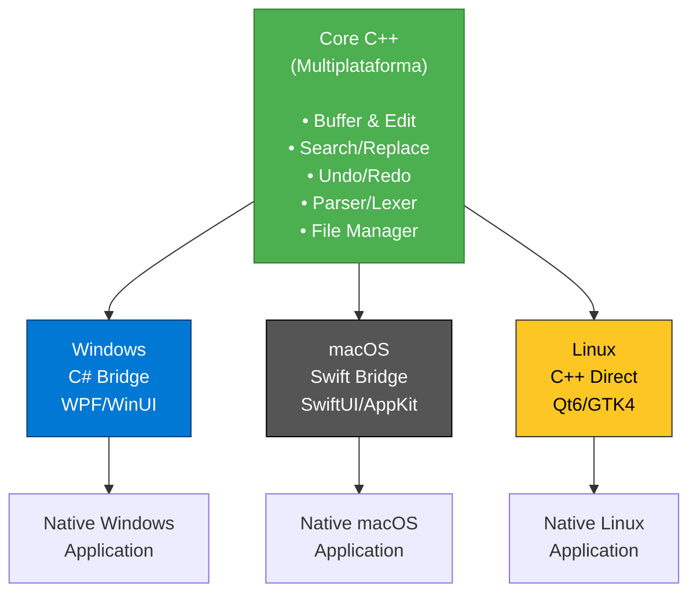

# TextEditor

[](https://github.com/incognia/TextEditor/blob/main/LICENSE)
[](https://github.com/incognia/TextEditor)
[](https://github.com/incognia/TextEditor)
[](https://github.com/incognia/TextEditor)

Editor de texto simple, rápido y ligero multiplataforma construido con tecnologías nativas para un rendimiento óptimo y experiencia de usuario en cada sistema operativo.

## Descripción general

TextEditor está diseñado para proporcionar una experiencia de edición consistente en todas las principales plataformas de escritorio, aprovechando marcos de trabajo y lenguajes nativos para obtener el mejor rendimiento e integración con cada sistema operativo.

## Arquitectura

TextEditor utiliza una arquitectura híbrida que maximiza el rendimiento y la experiencia nativa:



### Componente común (C++)

- **Buffer y edición**: gestión de texto, inserción, eliminación
- **Búsqueda y reemplazo**: lógica de búsqueda con expresiones regulares
- **Undo/Redo**: historial de cambios
- **Parsers y lexers**: análisis sintáctico y tokenización
- **Gestión de archivos**: lectura, escritura, codificación

### Capas nativas por plataforma

- **Windows**: Interfaz C# con bridges C++/CLI al core C++
- **macOS**: Interfaz Swift/Objective-C++ con interoperabilidad C++
- **Linux**: Interfaz Qt6/GTK4 directamente con el core C++

Esta arquitectura permite:
- ✅ GUI 100% nativa en cada plataforma
- ✅ Un único core de edición mantenido
- ✅ Cero duplicación de lógica de negocio
- ✅ Máximo rendimiento en cada sistema operativo

### Implementaciones específicas por plataforma

- **Windows**: C# con WPF/WinUI para experiencia nativa de Windows
- **macOS**: Swift con SwiftUI/AppKit para integración perfecta con macOS  
- **Linux (GNOME)**: C++ con GTK4 para integración moderna con escritorio GNOME
- **Linux (KDE Plasma)**: C++ con Qt6 para experiencia nativa con Plasma

## Características

### Funcionalidad principal

- [x] Edición de texto plano con resaltado de sintaxis
- [x] Edición de Markdown con vista previa en vivo
- [x] Soporte de múltiples pestañas
- [x] Búsqueda y reemplazo
- [x] Guardado automático y restauración de sesión
- [x] Temas personalizables (modo oscuro/claro)

### Soporte de Markdown

- [x] Cumplimiento de especificación CommonMark
- [x] Extensiones GitHub Flavored Markdown (GFM)
- [x] Vista previa en vivo con desplazamiento sincronizado
- [x] Soporte para edición de tablas
- [x] Renderizado de diagramas Mermaid
- [x] Expresiones matemáticas (LaTeX/KaTeX)

### Internacionalización

- [x] Inglés (en)
- [x] Español (es)
- [x] Francés (fr)
- [x] Alemán (de)
- [ ] Más idiomas (¡contribuciones bienvenidas!)

## Instalación

### Windows

```powershell
# Descargar desde Microsoft Store (recomendado)
winget install TextEditor

# O descargar instalador .msix desde releases
# https://github.com/yourusername/TextEditor/releases
```

### macOS

```bash
# Descargar desde Mac App Store (recomendado)
# O instalar vía Homebrew
brew install --cask texteditor

# O descargar .dmg desde releases
# https://github.com/yourusername/TextEditor/releases
```

### Linux

#### Ubuntu/Debian

```bash
# Descargar paquete .deb desde releases
sudo dpkg -i texteditor_1.0.0_amd64.deb
sudo apt-get install -f  # Arreglar dependencias si es necesario
```

#### Fedora/RHEL

```bash
# Descargar paquete .rpm desde releases
sudo dnf install texteditor-1.0.0-1.x86_64.rpm
```

#### Arch Linux

```bash
# Instalar desde AUR
yay -S texteditor-git
```

#### Flatpak (Universal)

```bash
flatpak install flathub io.github.yourusername.TextEditor
```

#### AppImage (Portátil)

```bash
# Descargar AppImage desde releases
chmod +x TextEditor-1.0.0-x86_64.AppImage
./TextEditor-1.0.0-x86_64.AppImage
```

## Desarrollo

### Requisitos previos

#### Desarrollo en Windows

- Visual Studio 2022 (17.8+)
- .NET 8.0 SDK
- Windows 11 SDK

#### Desarrollo en macOS

- Xcode 15.0+
- Swift 5.9+
- macOS 14.0+ SDK

#### Desarrollo en Linux

- GCC 11+ o Clang 15+
- CMake 3.25+
- Bibliotecas de desarrollo GTK4 (para GNOME)
- Bibliotecas de desarrollo Qt6 (para KDE Plasma)

### Compilar desde el código fuente

#### Windows

```powershell
git clone https://github.com/yourusername/TextEditor.git
cd TextEditor/src/windows
dotnet restore
dotnet build --configuration Release
```

#### macOS

```bash
git clone https://github.com/yourusername/TextEditor.git
cd TextEditor/src/macos
xcodebuild -scheme TextEditor -configuration Release
```

#### Linux (GTK4/GNOME)

```bash
git clone https://github.com/yourusername/TextEditor.git
cd TextEditor/src/linux/gtk
mkdir build && cd build
cmake .. -DCMAKE_BUILD_TYPE=Release
make -j$(nproc)
```

#### Linux (Qt6/KDE)

```bash
git clone https://github.com/yourusername/TextEditor.git
cd TextEditor/src/linux/qt
mkdir build && cd build
cmake .. -DCMAKE_BUILD_TYPE=Release
make -j$(nproc)
```

## Estructura del proyecto

```
TextEditor/
├── README.md
├── LICENSE
├── CONTRIBUTING.md
├── CODE_OF_CONDUCT.md
├── docs/
│   ├── user-guide/
│   ├── developer-guide/
│   └── api-reference/
├── core/                # ✅ COMPONENTE COMÚN (C++ multiplataforma)
│   ├── CMakeLists.txt
│   ├── include/
│   │   ├── editor/
│   │   │   ├── Buffer.h
│   │   │   ├── Editor.h
│   │   │   ├── UndoRedo.h
│   │   │   └── Selection.h
│   │   ├── parser/
│   │   │   ├── Lexer.h
│   │   │   ├── Parser.h
│   │   │   └── SyntaxTree.h
│   │   ├── search/
│   │   │   ├── FindReplace.h
│   │   │   └── Regex.h
│   │   └── file/
│   │       ├── FileManager.h
│   │       └── Encoding.h
│   └── src/
│       ├── editor/
│       ├── parser/
│       ├── search/
│       └── file/
├── platform/
│   ├── windows/           # Capa nativa: C# WPF/WinUI
│   │   ├── CMakeLists.txt
│   │   ├── TextEditor.sln
│   │   ├── UI/
│   │   │   ├── MainWindow.xaml
│   │   │   └── EditorControl.xaml
│   │   └── Interop/
│   │       ├── CoreBridge.h
│   │       └── CoreBridge.cpp
│   ├── macos/            # Capa nativa: Swift SwiftUI/AppKit
│   │   ├── CMakeLists.txt
│   │   ├── TextEditor.xcodeproj
│   │   ├── Swift/
│   │   │   ├── ContentView.swift
│   │   │   └── EditorView.swift
│   │   └── Interop/
│   │       ├── CoreBridge.h
│   │       └── CoreBridge.mm
│   └── linux/            # Capa nativa: Qt6/GTK4
│       ├── CMakeLists.txt
│       ├── gtk/
│       │   ├── CMakeLists.txt
│       │   ├── src/
│       │   ├── include/
│       │   └── tests/
│       └── qt/
│           ├── CMakeLists.txt
│           ├── src/
│           ├── include/
│           └── tests/
├── shared/
│   ├── localization/     # Archivos de traducción
│   │   ├── en.json
│   │   ├── es.json
│   │   ├── fr.json
│   │   └── de.json
│   ├── themes/           # Temas de interfaz
│   └── icons/            # Iconos de la aplicación
├── scripts/              # *Scripts* de compilación y despliegue
│   ├── build-windows.ps1
│   ├── build-macos.sh
│   └── build-linux.sh
└── packages/             # Configuraciones de paquetes
    ├── windows/          # Configuraciones MSIX, MSI
    ├── macos/            # Configuraciones DMG, PKG
    └── linux/            # DEB, RPM, AppImage, Flatpak
```

## Configuración

### Ubicación de configuraciones

- **Windows**: `%APPDATA%\TextEditor\settings.json`
- **macOS**: `~/Library/Application Support/TextEditor/settings.json`
- **Linux**: `~/.config/TextEditor/settings.json`

### Configuración predeterminada

```json
{
  "theme": "auto",
  "language": "auto",
  "font": {
    "family": "system",
    "size": 14
  },
  "editor": {
    "tabSize": 4,
    "wordWrap": true,
    "showLineNumbers": true,
    "autoSave": true,
    "autoSaveInterval": 30
  },
  "markdown": {
    "enablePreview": true,
    "syncScroll": true,
    "renderMath": true,
    "renderDiagrams": true
  }
}
```

## Contribuir

¡Damos la bienvenida a las contribuciones de la comunidad! Por favor lee nuestras [Guías de contribución](CONTRIBUTING.md) para detalles sobre:

- Código de conducta
- Flujo de trabajo de desarrollo
- Proceso de *pull request*
- Estándares de codificación para cada plataforma
- Contribuciones de traducción

### Configuración de desarrollo

1. Haz *fork* del repositorio
2. Clona tu *fork*: `git clone https://github.com/yourusername/TextEditor.git`
3. Crea una rama de funcionalidad: `git checkout -b feature/funcionalidad-increible`
4. Haz tus cambios siguiendo los estándares de codificación específicos de la plataforma
5. Prueba tus cambios completamente
6. Haz *commit* con commits convencionales: `git commit -m "feat: add amazing feature"`
7. Sube a tu rama: `git push origin feature/funcionalidad-increible`
8. Abre un *Pull Request*

## Hoja de ruta

### Versión 1.1 (Q2 2025)

- [ ] Arquitectura de sistema de plugins
- [ ] Búsqueda avanzada con soporte de regex
- [ ] Integración con Git
- [ ] Modo de escritura sin distracciones

### Versión 1.2 (Q3 2025)

- [ ] Edición colaborativa (tiempo real)
- [ ] Sincronización en la nube
- [ ] Sistema avanzado de temas
- [ ] Optimizaciones de rendimiento

### Versión 2.0 (Q4 2025)

- [ ] Asistencia de escritura con IA
- [ ] Extensiones avanzadas de Markdown
- [ ] Terminal integrada
- [ ] Características de gestión de proyectos

## Licencia

Este proyecto está licenciado bajo la Licencia Pública General de GNU v3.0 - consulta el archivo [LICENSE](LICENSE) para detalles.

## Reconocimientos

- [CommonMark](https://commonmark.org/) por la especificación de Markdown
- [Mermaid](https://mermaid-js.github.io/) por el renderizado de diagramas
- [KaTeX](https://katex.org/) por el renderizado de matemáticas
- [Highlight.js](https://highlightjs.org/) por el resaltado de sintaxis
- Nuestra increíble comunidad de contribuidores y traductores

## Soporte

- 📖 [Documentación](https://texteditor-docs.example.com)
- 💬 [Discusiones de la comunidad](https://github.com/yourusername/TextEditor/discussions)
- 🐛 [Rastreador de problemas](https://github.com/yourusername/TextEditor/issues)
- 📧 [Contacto](mailto:support@texteditor.example.com)

---

**Hecho con ❤️ por el equipo de TextEditor**

*Admitiendo Windows, macOS y Linux con rendimiento nativo y experiencia de usuario.*