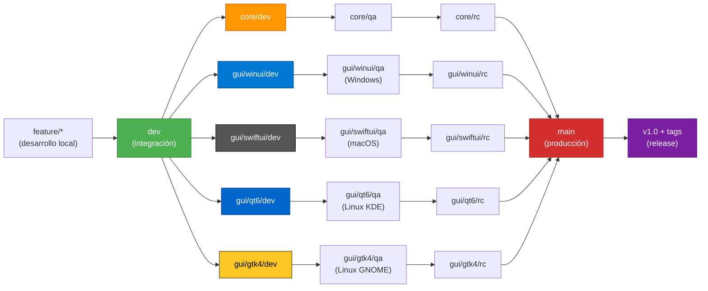
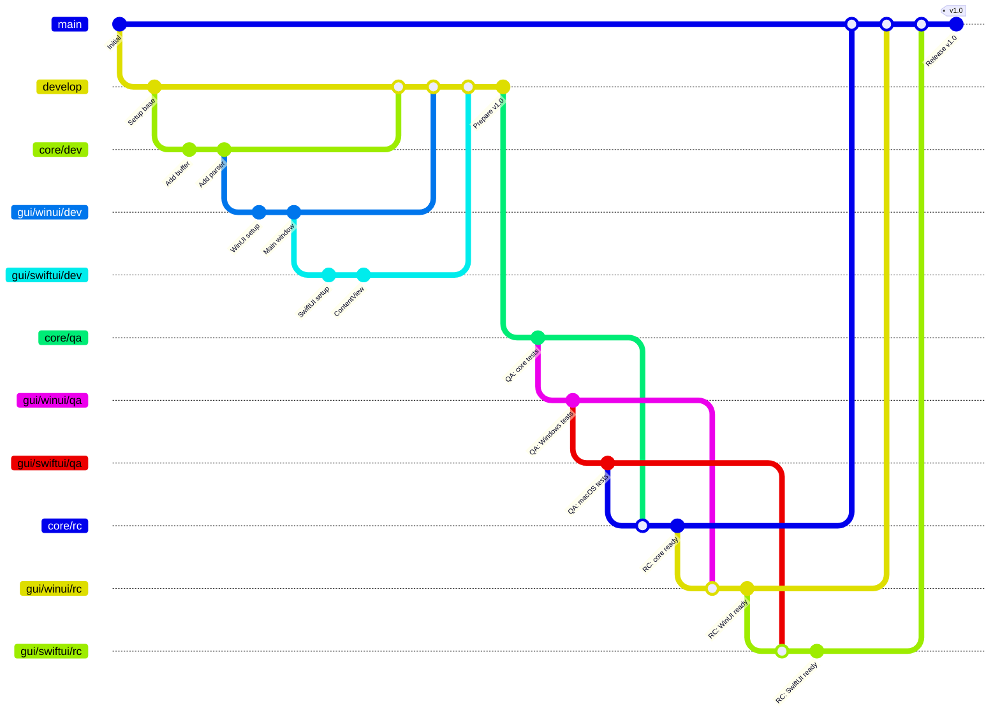

# Estrategia de ramas - TextEditor

## Visión general

TextEditor utiliza una estrategia de ramas con cuatro niveles principales: **dev**, **qa**, **rc** y **main**, más ramas especializadas para el **core** y cada **GUI** (WinUI, SwiftUI, Qt6, GTK4).

Cada rama representa un estado del código:
- **dev**: Integración de features en desarrollo
- **qa**: Pruebas en sistemas operativos específicos
- **rc**: Release candidate listo para producción
- **main**: Código en producción verificado

### Diagrama de flujo



### Ejemplo de flujo Git (release v1.0)



## Estructura de ramas

```
dev (integración de features)
├── core/dev
├── gui/winui/dev
├── gui/swiftui/dev
├── gui/qt6/dev
└── gui/gtk4/dev
    ↓
qa (pruebas en OS específicos)
├── core/qa
├── gui/winui/qa (prueba en Windows)
├── gui/swiftui/qa (prueba en macOS)
├── gui/qt6/qa (prueba en Linux-KDE)
└── gui/gtk4/qa (prueba en Linux-GNOME)
    ↓
rc (release candidate)
├── core/rc
├── gui/winui/rc
├── gui/swiftui/rc
├── gui/qt6/rc
└── gui/gtk4/rc
    ↓
main (producción)
└── v1.0, v1.1, v1.2... (tags)
```

## Descripción de ramas

### Rama `dev` (Desarrollo)

**Propósito**: integración continua de *features* en desarrollo desde todas las plataformas.

**Protecciones**:
- Requiere *pull request* con review
- *CI/CD* debe pasar (*linting*, tests básicos)
- Rama base para ramas de *features*

**Subramas por componente**:
- `core/dev` - Core C++ compartido
- `gui/winui/dev` - GUI Windows
- `gui/swiftui/dev` - GUI macOS
- `gui/qt6/dev` - GUI Linux KDE
- `gui/gtk4/dev` - GUI Linux GNOME

### Rama `qa` (Aseguramiento de calidad)

**Propósito**: pruebas exhaustivas en sistemas operativos específicos antes del *release*.

**Flujo**:
- Se crea desde `dev` cuando se decide hacer un *release*
- Cada subbrama se prueba en su OS objetivo
- Solo bugs críticos se arreglan aquí (no *features* nuevos)

**Responsabilidades por plataforma**:
- `gui/winui/qa` - Tester en **Windows**
- `gui/swiftui/qa` - Tester en **macOS**
- `gui/qt6/qa` - Tester en **Linux KDE**
- `gui/gtk4/qa` - Tester en **Linux GNOME**

### Rama `rc` (Candidato a release)

**Propósito**: código aprobado en *QA*, listo para producción.

**Características**:
- Solo bugs críticos pueden *mergearse*
- Se generan binarios oficiales desde estas ramas
- *Tags* como `v1.0-core`, `v1.0-winui`, etcétera

### Rama `main` (Producción)

**Protecciones**:
- Solo se acepta desde `rc`
- Requiere *tag* de versión
- Historial limpio y lineal

**Tags de versión**:
```
v1.0           - Release completa (core + todas las GUIs)
v1.0-core      - Core solamente
v1.0-winui     - WinUI solamente
v1.0-swiftui   - SwiftUI solamente
v1.0-qt6       - Qt6 solamente
v1.0-gtk4      - GTK4 solamente
```

## Flujo de trabajo por plataforma

### Ejemplo: release v1.0

#### 1. Preparación (desde `main`)

```bash
# Core team crea rama de release
git checkout -b release/v1.0 dev

# Cada plataforma crea sus subramas
git checkout -b core/rc release/v1.0
git checkout -b gui/winui/rc release/v1.0
git checkout -b gui/swiftui/rc release/v1.0
git checkout -b gui/qt6/rc release/v1.0
git checkout -b gui/gtk4/rc release/v1.0
```

#### 2. QA por plataforma (en paralelo, OS específico)

**Windows (WinUI)**:
```bash
git checkout gui/winui/qa
# Ejecutar tests en Windows
# Si hay bugs: fix → commit → push
# Si aprobado: merge a gui/winui/rc
git checkout gui/winui/rc
git merge gui/winui/qa
```

**macOS (SwiftUI)**:
```bash
git checkout gui/swiftui/qa
# Ejecutar tests en macOS
# Si hay bugs: fix → commit → push
# Si aprobado: merge a gui/swiftui/rc
git checkout gui/swiftui/rc
git merge gui/swiftui/qa
```

**Linux KDE (Qt6)**:
```bash
git checkout gui/qt6/qa
# Ejecutar tests en Linux KDE
# Si hay bugs: fix → commit → push
# Si aprobado: merge a gui/qt6/rc
git checkout gui/qt6/rc
git merge gui/qt6/qa
```

**Linux GNOME (GTK4)**:
```bash
git checkout gui/gtk4/qa
# Ejecutar tests en Linux GNOME
# Si hay bugs: fix → commit → push
# Si aprobado: merge a gui/gtk4/rc
git checkout gui/gtk4/rc
git merge gui/gtk4/qa
```

#### 3. Release (merge a `main`)

**Cuando todas las plataformas aprueban:**

Al completar *QA*, procede el *merge* a `main` con los *tags* correspondientes:

```bash
# Merge de core
git checkout main
git merge core/rc
git tag v1.0-core

# Merge de cada GUI
git merge gui/winui/rc
git tag v1.0-winui

git merge gui/swiftui/rc
git tag v1.0-swiftui

git merge gui/qt6/rc
git tag v1.0-qt6

git merge gui/gtk4/rc
git tag v1.0-gtk4

# Tag de versión completa
git tag v1.0
git push origin main --tags
```

#### 4. GitHub Release

Crear *release* `v1.0` en GitHub con binarios compilados:
- `texteditor-1.0-windows.msix`
- `TextEditor-1.0.dmg`
- `texteditor-1.0-qt6-x86_64.AppImage`
- `texteditor-1.0-gtk4-x86_64.AppImage`

## Gestión de ramas de features

### Ramas de features

```bash
# Crear desde dev
git checkout -b feature/nombre-feature dev

# Trabajo normal
git add .
git commit -m "feat(scope): descripción"
git push origin feature/nombre-feature

# Pull request a dev (requiere review)
# Merge automático después de aprobación
```

### Correcciones urgentes en producción

Si hay un *bug* crítico en `main`:

```bash
# Corrección urgente desde *main*
*git* checkout -b hotfix/nombre-critico *main*

# Corrección → *commit* → *pull request* a *main* y `dev`
git checkout main
git merge hotfix/nombre-critico
git tag v1.0.1

# También merge a dev para sincronizar
git checkout dev
git merge hotfix/nombre-critico
```

## Protecciones de ramas

| Rama | *Pull request* requerido | Review requerido | CI/CD | Merge automático |
|------|-------------|------------------|-------|-----------------|
| `main` | ✅ | ✅ | ✅ | ❌ |
| `rc` | ✅ | ✅ | ✅ | ❌ |
| `qa` | ✅ | ✅ | ⚠️ | ❌ |
| `dev` | ✅ | ✅ | ✅ | ❌ |
| `feature/*` | ✅ | ✅ | ✅ | ✅ |

## Nombres de commits

Usar ***Conventional Commits*** en inglés:

```
feat(gui/winui): add dark mode toggle
fix(core): correct buffer allocation
docs: update branching strategy
test(parser): add lexer edge cases
```

## Regla: un tester por OS

- **Windows**: Tester en máquina Windows compila y prueba `gui/winui/qa`
- **macOS**: Tester en macOS compila y prueba `gui/swiftui/qa`
- **Linux KDE**: Tester en Linux KDE compila y prueba `gui/qt6/qa`
- **Linux GNOME**: Tester en Linux GNOME compila y prueba `gui/gtk4/qa`

Esto garantiza que cada *GUI* se prueba en su entorno nativo.

## Descarga selectiva por plataforma

En ramas **dev**, **qa** y **rc**, **no clonar el repositorio completo**. Descargar solo el *core* + la *GUI* nativa correspondiente a tu plataforma de desarrollo/prueba. No tiene caso bajar código que no compilará:

**Aplicable a**:
- `core/dev`, `gui/*/dev` - Desarrollo local
- `core/qa`, `gui/*/qa` - Pruebas en *QA*
- `core/rc`, `gui/*/rc` - *Release candidate* en *QA*

### macOS (SwiftUI)

```bash
# Clonar repositorio vacío
git clone --no-checkout git@github.com:incognia/TextEditor.git
cd TextEditor

# Descargar solo core + GUI macOS
git sparse-checkout init --cone
git sparse-checkout set core platform/macos
git checkout gui/swiftui/qa
```

### Windows (WinUI)

```bash
git clone --no-checkout git@github.com:incognia/TextEditor.git
cd TextEditor

git sparse-checkout init --cone
git sparse-checkout set core platform/windows
git checkout gui/winui/qa
```

### Linux KDE (Qt6)

```bash
git clone --no-checkout git@github.com:incognia/TextEditor.git
cd TextEditor

git sparse-checkout init --cone
git sparse-checkout set core platform/linux/qt
git checkout gui/qt6/qa
```

### Linux GNOME (GTK4)

```bash
git clone --no-checkout git@github.com:incognia/TextEditor.git
cd TextEditor

git sparse-checkout init --cone
git sparse-checkout set core platform/linux/gtk
git checkout gui/gtk4/qa
```

### Ventajas

- ✅ Descarga ~70% menos código innecesario
- ✅ *Build* más rápido (menos I/O de disco)
- ✅ Pruebas más rápidas
- ✅ Menos espacio en disco en máquinas de desarrollo y *QA*
- ✅ Compilación nativa solo del *core* + *GUI* correspondiente
- ✅ Evita errores de compilación en código de otras plataformas

## Sincronización de core

El ***core*** *C++* es compartido. Si hay cambios:

1. **Cambio en `core/dev`**
2. Todos los desarrolladores de *GUI* descargan (*pull*) la versión nueva
3. Recompilan y prueban sus *GUIs*
4. Resuelven conflictos si es necesario
5. Envían (*push*) a sus ramas respectivas

## Referencias

- [Conventional Commits](https://www.conventionalcommits.org/)
- Guía de desarrollo: `CONTRIBUTING.md`
- Workflow de commits: `.warp/cot/committing.md`
- Reglas de commits: `.warp/rules/COMMITTING.md`
