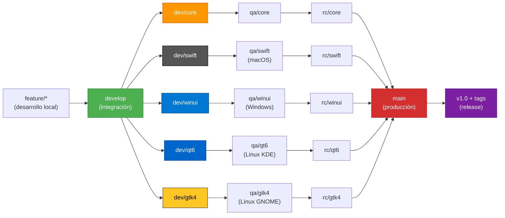
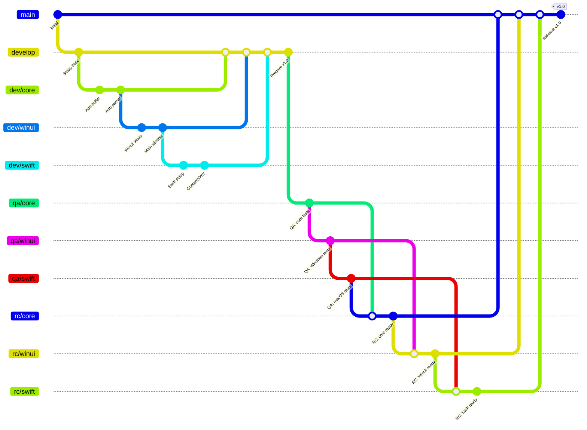

# Estrategia de ramas - TextEditor

## Visión general

TextEditor utiliza una estrategia de ramas con tres niveles principales: **develop**, **testing** y **release**, más subramas especializadas (`dev/`, `qa/`, `rc/`) para el **core** y cada **GUI** (Swift, WinUI, Qt6, GTK4).

Cada rama principal representa un estado del código:

- **develop**: Integración de *features* en desarrollo
- **testing**: Pruebas en sistemas operativos específicos
- **release**: Release candidate listo para producción
- **main**: Código en producción verificado

**Nomenclatura de subramas**:

- `dev/core`, `dev/swift`, `dev/winui`, `dev/qt6`, `dev/gtk4` (desde `develop`)
- `qa/core`, `qa/swift`, `qa/winui`, `qa/qt6`, `qa/gtk4` (desde `testing`)
- `rc/core`, `rc/swift`, `rc/winui`, `rc/qt6`, `rc/gtk4` (desde `release`)

### Diagrama de flujo



### Ejemplo de flujo Git (release v1.0)



## Estructura de ramas

```text
develop (integración de features)
├── dev/core
├── dev/swift
├── dev/winui
├── dev/qt6
└── dev/gtk4
    ↓
testing (pruebas en OS específicos)
├── qa/core
├── qa/swift (prueba en macOS)
├── qa/winui (prueba en Windows)
├── qa/qt6 (prueba en Linux-KDE)
└── qa/gtk4 (prueba en Linux-GNOME)
    ↓
release (candidato a release)
├── rc/core
├── rc/swift
├── rc/winui
├── rc/qt6
└── rc/gtk4
    ↓
main (producción)
└── v1.0, v1.1, v1.2... (tags)
```

## Descripción de ramas

### Rama `develop` (Desarrollo)

**Propósito**: integración continua de *features* en desarrollo desde todas las plataformas.

**Protecciones**:

- Requiere *pull request* con review
- *CI/CD* debe pasar (*linting*, tests básicos)
- Rama base para ramas de *features*

**Subramas por componente**:

- `dev/core` - Core C++ compartido
- `dev/swift` - GUI macOS (SwiftUI)
- `dev/winui` - GUI Windows (WinUI)
- `dev/qt6` - GUI Linux KDE (Qt6)
- `dev/gtk4` - GUI Linux GNOME (GTK4)

### Rama `testing` (Aseguramiento de calidad)

**Propósito**: pruebas exhaustivas en sistemas operativos específicos antes del *release*.

**Flujo**:

- Se crea desde `develop` cuando se decide hacer un *release*
- Cada subbrama se prueba en su OS objetivo
- Solo bugs críticos se arreglan aquí (no *features* nuevos)

**Responsabilidades por plataforma**:

- `qa/winui` - Tester en **Windows**
- `qa/swift` - Tester en **macOS**
- `qa/qt6` - Tester en **Linux KDE**
- `qa/gtk4` - Tester en **Linux GNOME**

### Rama `release` (Candidato a release)

**Propósito**: código aprobado en *testing*, listo para producción.

**Características**:

- Solo bugs críticos pueden *mergearse*
- Se generan binarios oficiales desde estas ramas
- *Tags* como `v1.0-core`, `v1.0-swift`, `v1.0-winui`, `v1.0-qt6`, `v1.0-gtk4`

### Rama `main` (Producción)

**Protecciones**:

- Solo se acepta desde `release`
- Requiere *tag* de versión
- Historial limpio y lineal

**Tags de versión**:

```text
v1.0           - Release completa (core + todas las GUIs)
v1.0-core      - Core solamente
v1.0-swift     - Swift solamente
v1.0-winui     - WinUI solamente
v1.0-qt6       - Qt6 solamente
v1.0-gtk4      - GTK4 solamente
```

## Flujo de trabajo por plataforma

### Ejemplo: release v1.0

#### 1. Preparación (desde `develop`)

```bash
# Core team crea ramas de candidato a release
git checkout -b rc/core release
git checkout -b rc/swift release
git checkout -b rc/winui release
git checkout -b rc/qt6 release
git checkout -b rc/gtk4 release
```

#### 2. QA por plataforma (en paralelo, OS específico)

**Windows (WinUI)**:

```bash
git checkout qa/winui
# Ejecutar tests en Windows
# Si hay bugs: fix → commit → push
# Si aprobado: merge a rc/winui
git checkout rc/winui
git merge qa/winui
```

**macOS (Swift)**:

```bash
git checkout qa/swift
# Ejecutar tests en macOS
# Si hay bugs: fix → commit → push
# Si aprobado: merge a rc/swift
git checkout rc/swift
git merge qa/swift
```

**Linux KDE (Qt6)**:

```bash
git checkout qa/qt6
# Ejecutar tests en Linux KDE
# Si hay bugs: fix → commit → push
# Si aprobado: merge a rc/qt6
git checkout rc/qt6
git merge qa/qt6
```

**Linux GNOME (GTK4)**:

```bash
git checkout qa/gtk4
# Ejecutar tests en Linux GNOME
# Si hay bugs: fix → commit → push
# Si aprobado: merge a rc/gtk4
git checkout rc/gtk4
git merge qa/gtk4
```

#### 3. Release (merge a `main`)

**Cuando todas las plataformas aprueban:**

Al completar *QA*, procede el *merge* a `main` con los *tags* correspondientes:

```bash
# Merge de core
git checkout main
git merge rc/core
git tag v1.0-core

# Merge de cada GUI
git merge rc/swift
git tag v1.0-swift

git merge rc/winui
git tag v1.0-winui

git merge rc/qt6
git tag v1.0-qt6

git merge rc/gtk4
git tag v1.0-gtk4

# Tag de versión completa
git tag v1.0
git push origin main --tags
```

#### 4. GitHub Release

Crear *release* `v1.0` en GitHub con binarios compilados:

- `texteditor-1.0-windows.msix`
- `TextEditor-1.0.dmg`
- `texteditor-1.0-qt6-x86_64.AppImage`
- `texteditor-1.0-gtk4-x86_64.AppImage`

## Gestión de ramas de features

### Ramas de features

```bash
# Crear desde develop
git checkout -b feature/nombre-feature develop

# Trabajo normal
git add .
git commit -m "feat(scope): descripción"
git push origin feature/nombre-feature

# Pull request a develop (requiere review)
# Merge automático después de aprobación
```

### Correcciones urgentes en producción

Si hay un *bug* crítico en `main`:

```bash
# Corrección urgente desde *main*
*git* checkout -b hotfix/nombre-critico *main*

# Corrección → *commit* → *pull request* a *main* y `develop`
git checkout main
git merge hotfix/nombre-critico
git tag v1.0.1

# También merge a develop para sincronizar
git checkout develop
git merge hotfix/nombre-critico
```

## Protecciones de ramas

| Rama | *Pull request* requerido | Review requerido | CI/CD | Merge automático |
|------|-------------|------------------|-------|-----------------|
| `main` | ✅ | ✅ | ✅ | ❌ |
| `release` | ✅ | ✅ | ✅ | ❌ |
| `testing` | ✅ | ✅ | ⚠️ | ❌ |
| `develop` | ✅ | ✅ | ✅ | ❌ |
| `feature/*` | ✅ | ✅ | ✅ | ✅ |

## Nombres de commits

Usar ***Conventional Commits*** en inglés:

```text
feat(gui/winui): add dark mode toggle
fix(core): correct buffer allocation
docs: update branching strategy
test(parser): add lexer edge cases
```

## Regla: un tester por OS

- **Windows**: Tester en máquina Windows compila y prueba `qa/winui`
- **macOS**: Tester en macOS compila y prueba `qa/swift`
- **Linux KDE**: Tester en Linux KDE compila y prueba `qa/qt6`
- **Linux GNOME**: Tester en Linux GNOME compila y prueba `qa/gtk4`

Esto garantiza que cada *GUI* se prueba en su entorno nativo.

## Descarga selectiva por plataforma

En ramas **develop**, **testing** y **release**, **no clonar el repositorio completo**. Descargar solo el *core* + la *GUI* nativa correspondiente a tu plataforma de desarrollo/prueba. No tiene caso bajar código que no compilará:

**Aplicable a**:

- `dev/core`, `dev/swift`, `dev/winui`, `dev/qt6`, `dev/gtk4` - Desarrollo local
- `qa/core`, `qa/swift`, `qa/winui`, `qa/qt6`, `qa/gtk4` - Pruebas en *testing*
- `rc/core`, `rc/swift`, `rc/winui`, `rc/qt6`, `rc/gtk4` - *Release candidate* en *release*

### macOS (Swift)

```bash
# Clonar repositorio vacío
git clone --no-checkout git@github.com:incognia/TextEditor.git
cd TextEditor

# Descargar solo core + GUI macOS
git sparse-checkout init --cone
git sparse-checkout set core platform/macos shared docs .warp scripts
git checkout qa/swift
```

### Windows (WinUI)

```bash
git clone --no-checkout git@github.com:incognia/TextEditor.git
cd TextEditor

git sparse-checkout init --cone
git sparse-checkout set core platform/windows shared docs .warp scripts
git checkout qa/winui
```

### Linux KDE (Qt6)

```bash
git clone --no-checkout git@github.com:incognia/TextEditor.git
cd TextEditor

git sparse-checkout init --cone
git sparse-checkout set core platform/linux/qt shared docs .warp scripts
git checkout qa/qt6
```

### Linux GNOME (GTK4)

```bash
git clone --no-checkout git@github.com:incognia/TextEditor.git
cd TextEditor

git sparse-checkout init --cone
git sparse-checkout set core platform/linux/gtk shared docs .warp scripts
git checkout qa/gtk4
```

### Ventajas

- ✅ Descarga ~70% menos código innecesario
- ✅ *Build* más rápido (menos I/O de disco)
- ✅ Pruebas más rápidas
- ✅ Menos espacio en disco en máquinas de desarrollo y *QA*
- ✅ Compilación nativa solo del *core* + *GUI* correspondiente
- ✅ Evita errores de compilación en código de otras plataformas

## Sincronización de core

El ***core*** *C++* es compartido. Si hay cambios:

1. **Cambio en `dev/core`**
2. Todos los desarrolladores de *GUI* descargan (*pull*) la versión nueva
3. Recompilan y prueban sus *GUIs*
4. Resuelven conflictos si es necesario
5. Envían (*push*) a sus ramas respectivas

## Referencias

- [Conventional Commits](https://www.conventionalcommits.org/)
- Guía de desarrollo: `CONTRIBUTING.md`
- Workflow de commits: `.warp/cot/committing.md`
- Reglas de commits: `.warp/rules/COMMITTING.md`
