# Estrategia de CI/CD - TextEditor

Estrategia de integración y despliegue continuo para TextEditor usando GitHub Actions y Argo CD.

## Visión general

TextEditor utiliza una **estrategia híbrida** de CI/CD que combina desarrollo local en macOS con GitHub Actions para automatización multiplataforma. Esta aproximación optimiza costos y velocidad de desarrollo mientras mantiene la calidad y automatización necesarias.

### Estrategia de implementación por fases

| Fase | Descripción | Costo mensual | Cuándo activar |
|------|-------------|---------------|----------------|
| **Fase 1: Desarrollo local** | Compilación manual en Mac personal | $0 | Desarrollo inicial |
| **Fase 2: CI básico** | Solo Linux compilaciones + validación | $20-30 | Con contribuidores externos |
| **Fase 3: CI completo** | Todos los *runners* + *pipeline* completo | $50-80 | Proyecto maduro, lanzamientos |

### Arquitectura híbrida

```mermaid
graph TB
    Dev[Desarrollador Mac] --> |Desarrollo local| LocalBuild[Compilación Local<br/>macOS nativo]
    Dev --> |git push| Repo[GitHub Repository]
    
    LocalBuild --> |Validación manual| Ready[Listo para CI]
    
    Repo --> |webhook| GHA[GitHub Actions<br/>Activación por fases]
    
    GHA --> |Fase 1| Disabled[CI Desactivado<br/>Solo desarrollo local]
    GHA --> |Fase 2| BasicCI[CI Básico<br/>Linux + Windows]
    GHA --> |Fase 3| FullCI[CI Completo<br/>Todas las plataformas]
    
    FullCI --> Registry[Container Registry]
    Registry --> |GitOps| Argo[Argo CD]
    
    style LocalBuild fill:#34d399,stroke:#059669,color:#fff
    style BasicCI fill:#fbbf24,stroke:#f59e0b,color:#000
    style FullCI fill:#2188ff,stroke:#0366d6,color:#fff
```



## Estimación de costos GitHub Actions

### Precios por runner (2025)

| Runner | Precio/minuto | Multiplicador | Uso recomendado |
|--------|---------------|---------------|------------------|
| Linux | $0.008 | 1x | Core C++, validaciones |
| Windows | $0.016 | 2x | Compilación .NET/C# |
| macOS | $0.08 | 10x | Solo para lanzamientos importantes |

### Costo por compilación completo

| Plataforma | Tiempo estimado | Costo por compilación |
|------------|----------------|------------------|
| Core C++ (Linux) | 5 min | $0.04 |
| Windows (C#/.NET) | 8 min | $0.128 |
| macOS (Swift) | 12 min | $0.96 |
| Linux GTK | 6 min | $0.048 |
| Linux Qt | 6 min | $0.048 |
| **Total compilación completa** | **37 min** | **$1.224** |

### Escenarios de uso mensual

#### Desarrollo activo (equipo completo)
- 10 confirmaciones de cambios/día en features (Linux): $36/mes
- 2 merges/día a dev (completo): $73.5/mes  
- 1 merge/día a qa: $45/mes
- 4 releases/mes a main: $6/mes

**Total: ~$160/mes**

#### Desarrollo híbrido (recomendado)
- Compilación local en Mac: $0
- 5 builds Linux/semana: $8/mes
- 2 builds completos/mes: $2.5/mes

**Total: ~$10-15/mes**

## Desarrollo local (Fase 1)

### Configuración del entorno de desarrollo macOS

```bash
# Herramientas necesarias
xcode-select --install
brew install cmake
brew install qt@6  # Para pruebas de Linux Qt localmente

# Compilación local del core C++
mkdir build-local && cd build-local
cmake ../core -DCMAKE_BUILD_TYPE=Debug -DBUILD_TESTS=ON
make -j$(sysctl -n hw.ncpu)

# Compilación macOS nativa
cd ../platform/macos
xcodebuild -scheme TextEditor -configuration Debug build
```

### Workflow de desarrollo local

1. **Desarrollo**: compilación y pruebas en Mac local
2. **Validación**: pruebas unitarias y funcionales
3. **Commit**: push a feature branches
4. **Review**: código revisado antes de merge
5. **CI**: solo cuando sea necesario (merges importantes)

### Ventajas del desarrollo local

✅ **Velocidad**: compilación instantánea sin esperar runners
✅ **Depuración**: Xcode completo, breakpoints, profiling
✅ **Iteración rápida**: cambios inmediatos, hot reload
✅ **Costo cero**: sin gasto en runners durante desarrollo
✅ **Offline**: trabajo sin conexión a internet

## Estrategia de ramas y CI/CD

### 1. Integración de estrategia de ramas (por fases)

Cada rama activa diferentes *pipelines* según la fase actual y la [estrategia de ramificación](./BRANCHING.md):

#### Fase 1: Solo desarrollo local
| Branch | Pipeline | Despliegue | Ambiente |
|--------|----------|------------|----------|
| `feature/*` | ❌ Local only | ❌ No deploy | Local Mac |
| `develop` | ❌ Local only | ❌ No deploy | Local Mac |
| `dev/*` | ❌ Local only | ❌ No deploy | Local Mac |
| `testing` | ❌ Local only | ❌ No deploy | Local Mac |
| `qa/*` | ❌ Local only | ❌ No deploy | Local Mac |
| `release` | ❌ Local only | ❌ No deploy | Local Mac |
| `rc/*` | ❌ Local only | ❌ No deploy | Local Mac |
| `main` | ❌ Local only | ❌ No deploy | Local Mac |

#### Fase 2: CI básico (con contribuidores)
| Branch | Pipeline | Despliegue | Ambiente |
|--------|----------|------------|----------|
| `feature/*` | ✅ Linux Build + Test | ❌ No deploy | N/A |
| `develop` | ✅ Linux + Windows | ✅ Auto-deploy | Development |
| `dev/*` | ✅ Linux + component-specific | ✅ Auto-deploy | Dev per component |
| `testing` | ✅ Linux + Windows + E2E | ✅ Auto-deploy | Testing/Staging |
| `qa/*` | ✅ Platform-specific E2E | ✅ Auto-deploy | QA per platform |
| `release` | ✅ All platforms | ✅ Manual approval | Release candidate |
| `rc/*` | ✅ All platforms | ✅ Manual approval | RC per component |
| `main` | ✅ All platforms + Release | ✅ Production deploy | Production |

#### Fase 3: CI completo (proyecto maduro)
| Branch | Pipeline | Despliegue | Ambiente |
|--------|----------|------------|----------|
| `feature/*` | ✅ Build + Test | ❌ No deploy | N/A |
| `develop` | ✅ Build + Test + Package | ✅ Auto-deploy | Development |
| `dev/*` | ✅ Component-specific builds | ✅ Auto-deploy | Component development |
| `testing` | ✅ Build + Test + Package + E2E | ✅ Auto-deploy | Testing/Staging |
| `qa/*` | ✅ Platform-specific E2E | ✅ Auto-deploy | QA per platform |
| `release` | ✅ Full Pipeline + Security Scan | ✅ Manual approval | Release candidate |
| `rc/*` | ✅ Full Pipeline + Security Scan | ✅ Manual approval | RC per component |
| `main` | ✅ Full Pipeline + Release | ✅ Production deploy | Production |

### Cuándo activar cada fase

#### 🟢 Activar Fase 2 (CI básico) cuando:
- Tengas **contribuidores externos**
- Necesites **validación automática** antes de merges
- Quieras **compilaciones reproducibles** para releases
- El proyecto tenga **más de 1000 líneas** de código

#### 🟡 Activar Fase 3 (CI completo) cuando:
- Tengas **usuarios finales** usando el software
- Necesites **lanzamientos frecuentes** (>1 por semana)
- Quieras **distribución automatizada**
- El proyecto sea **crítico** para producción

### Configuración de activación por fases

```yaml
# .github/workflows/ci.yml
name: CI/CD Pipeline
on:
  push:
    branches: [develop, dev/*, testing, qa/*, release, rc/*, main]
  pull_request:
    branches: [develop, testing, release, main]

env:
  # Controla qué fase está activa
  CI_PHASE: "1"  # 1=local, 2=basic, 3=full

jobs:
  # Fase 2: CI Básico
  linux-build:
    if: env.CI_PHASE >= '2'
    runs-on: ubuntu-latest
    # ... resto de configuración
  
  # Fase 3: CI Completo
  macos-build:
    if: env.CI_PHASE >= '3'
    runs-on: macos-latest
    # ... resto de configuración
```

### 2. Estrategia de compilación matricial

#### Core C++ (común a todas las plataformas)
```yaml
strategy:
  matrix:
    config: [Debug, Release]
    compiler: [gcc, clang]
    exclude:
      - config: Debug
        compiler: clang  # Solo Release con Clang para optimización
```

#### Compilaciones específicas por plataforma
```yaml
strategy:
  matrix:
    platform:
      - { os: windows-latest, name: windows, runtime: win-x64 }
      - { os: macos-latest, name: macos, runtime: osx-x64 }
      - { os: ubuntu-latest, name: linux-gtk, variant: gtk }
      - { os: ubuntu-latest, name: linux-qt, variant: qt }
```

## Definiciones de *pipeline*

### 3. Trabajos principales del *pipeline*

#### Trabajo 1: Validación y configuración
```yaml
validate:
  runs-on: ubuntu-latest
  steps:
    - name: Checkout code
      uses: actions/checkout@v4
      with:
        fetch-depth: 0  # Para análisis de commits convencionales
    
    - name: Validate conventional commits
      uses: wagoid/commitlint-github-action@v5
    
    - name: Lint C++ core
      run: |
        find core/ -name "*.cpp" -o -name "*.h" | xargs clang-format --dry-run --Werror
```

#### Trabajo 2: Compilación del core C++
```yaml
build-core:
  needs: validate
  runs-on: ubuntu-latest
  steps:
    - name: Setup CMake
      uses: jwlawson/actions-setup-cmake@v1.14
    
    - name: Build Core
      run: |
        mkdir build-core && cd build-core
        cmake ../core -DCMAKE_BUILD_TYPE=Release -DBUILD_TESTS=ON
        make -j$(nproc)
        ctest --output-on-failure
    
    - name: Upload core artifacts
      uses: actions/upload-artifact@v4
      with:
        name: core-library
        path: build-core/lib/
```

#### Trabajo 3: Compilaciones por plataforma (matricial)
```yaml
build-platforms:
  needs: build-core
  strategy:
    matrix:
      include:
        - os: windows-latest
          platform: windows
          build-script: scripts/build-windows.ps1
          artifact-path: platform/windows/bin/Release/
        
        - os: macos-latest
          platform: macos  
          build-script: scripts/build-macos.sh
          artifact-path: platform/macos/build/Release/
        
        - os: ubuntu-latest
          platform: linux-gtk
          build-script: scripts/build-linux-gtk.sh
          artifact-path: platform/linux/gtk/build/
        
        - os: ubuntu-latest
          platform: linux-qt
          build-script: scripts/build-linux-qt.sh  
          artifact-path: platform/linux/qt/build/
  
  runs-on: ${{ matrix.os }}
  steps:
    - name: Download core library
      uses: actions/download-artifact@v4
      with:
        name: core-library
        path: core/lib/
    
    - name: Build ${{ matrix.platform }}
      run: ${{ matrix.build-script }}
    
    - name: Package ${{ matrix.platform }}
      run: |
        cd ${{ matrix.artifact-path }}
        if [[ "${{ matrix.platform }}" == "windows" ]]; then
          7z a ../../texteditor-${{ matrix.platform }}.zip *
        else
          tar czf ../../texteditor-${{ matrix.platform }}.tar.gz *
        fi
```

### 4. Trabajos de despliegue

#### Despliegue de preparación (ramas develop/testing)
```yaml
deploy-staging:
  if: github.ref == 'refs/heads/develop' || github.ref == 'refs/heads/testing'
  needs: [build-platforms]
  runs-on: ubuntu-latest
  environment: 
    name: ${{ github.ref == 'refs/heads/develop' && 'development' || 'testing' }}
  steps:
    - name: Update K8s manifests
      run: |
        ENVIRONMENT=${{ github.ref == 'refs/heads/develop' && 'dev' || 'testing' }}
        
        # Actualizar imagen en manifests
        sed -i "s|image: ghcr.io/incognia/texteditor:.*|image: ghcr.io/incognia/texteditor:${{ github.sha }}|" \
          k8s/overlays/${ENVIRONMENT}/kustomization.yaml
        
        # Commit cambios al repo de manifests
        git config user.name "GitHub Actions"
        git config user.email "actions@github.com"
        git add k8s/overlays/${ENVIRONMENT}/
        git commit -m "feat(deploy): update ${ENVIRONMENT} to ${{ github.sha }}"
        git push
```

#### Lanzamiento de producción (rama main)
```yaml
release-production:
  if: github.ref == 'refs/heads/main'
  needs: [build-platforms, security-scan]
  runs-on: ubuntu-latest
  environment: 
    name: production
  steps:
    - name: Create GitHub Release
      uses: actions/create-release@v1
      with:
        tag_name: v${{ steps.version.outputs.version }}
        release_name: TextEditor v${{ steps.version.outputs.version }}
        draft: false
        prerelease: false
    
    - name: Deploy to production
      run: |
        # Actualizar manifests de producción
        sed -i "s|image: ghcr.io/incognia/texteditor:.*|image: ghcr.io/incognia/texteditor:v${{ steps.version.outputs.version }}|" \
          k8s/overlays/production/kustomization.yaml
```

## Estrategia de contenedores

### 5. Dockerfile multi-etapa

```dockerfile
# Build stage para core C++
FROM ubuntu:22.04 as core-builder
RUN apt-get update && apt-get install -y cmake g++ clang
COPY core/ /src/core/
WORKDIR /src/core
RUN mkdir build && cd build && cmake .. && make -j$(nproc)

# Build stage específico por plataforma
FROM node:18-alpine as web-builder
COPY platform/web/ /src/web/
WORKDIR /src/web
RUN npm ci && npm run build

# Runtime stage
FROM alpine:3.18
COPY --from=core-builder /src/core/build/lib/ /usr/lib/texteditor/
COPY --from=web-builder /src/web/dist/ /usr/share/texteditor/web/
EXPOSE 8080
CMD ["/usr/bin/texteditor-server"]
```

### 6. Estrategia de registro de paquetes

```yaml
# Configuración de ghcr.io
docker-build:
  runs-on: ubuntu-latest
  steps:
    - name: Login to GitHub Container Registry
      uses: docker/login-action@v3
      with:
        registry: ghcr.io
        username: ${{ github.actor }}
        password: ${{ secrets.GITHUB_TOKEN }}
    
    - name: Build and push
      uses: docker/build-push-action@v5
      with:
        platforms: linux/amd64,linux/arm64
        push: true
        tags: |
          ghcr.io/incognia/texteditor:latest
          ghcr.io/incognia/texteditor:${{ github.sha }}
          ghcr.io/incognia/texteditor:v${{ steps.version.outputs.version }}
```

## Integración con Argo CD

### 7. Estructura del repositorio GitOps

```
texteditor-manifests/
├── apps/
│   └── texteditor/
│       ├── base/
│       │   ├── deployment.yaml
│       │   ├── service.yaml
│       │   └── kustomization.yaml
│       └── overlays/
│           ├── development/
│           ├── qa/
│           └── production/
└── argocd/
    └── applications/
        ├── texteditor-dev.yaml
        ├── texteditor-qa.yaml
        └── texteditor-prod.yaml
```

### 8. Definición de aplicación Argo

```yaml
apiVersion: argoproj.io/v1alpha1
kind: Application
metadata:
  name: texteditor-production
  namespace: argocd
spec:
  project: default
  source:
    repoURL: https://github.com/incognia/texteditor-manifests
    targetRevision: main
    path: apps/texteditor/overlays/production
  destination:
    server: https://kubernetes.default.svc
    namespace: texteditor-prod
  syncPolicy:
    automated:
      prune: true
      selfHeal: true
    syncOptions:
    - CreateNamespace=true
```

## Seguridad y puertas de calidad

### 9. Escaneo de seguridad

```yaml
security-scan:
  runs-on: ubuntu-latest
  steps:
    - name: Run Trivy vulnerability scanner
      uses: aquasecurity/trivy-action@master
      with:
        image-ref: ghcr.io/incognia/texteditor:${{ github.sha }}
        format: 'sarif'
        output: 'trivy-results.sarif'
    
    - name: CodeQL Analysis
      uses: github/codeql-action/init@v2
      with:
        languages: cpp, csharp, swift
```

### 10. Puertas de calidad

```yaml
quality-gate:
  runs-on: ubuntu-latest
  steps:
    - name: SonarCloud Scan
      uses: SonarSource/sonarcloud-github-action@master
      env:
        GITHUB_TOKEN: ${{ secrets.GITHUB_TOKEN }}
        SONAR_TOKEN: ${{ secrets.SONAR_TOKEN }}
    
    - name: Performance tests
      run: |
        # Ejecutar pruebas de rendimiento
        ./scripts/performance-test.sh
        # Fallar si el rendimiento se degrada >10%
```

## Monitoreo y observabilidad

### 11. Observabilidad del *pipeline*

```yaml
notify:
  if: always()
  needs: [deploy-staging, deploy-production]
  runs-on: ubuntu-latest
  steps:
    - name: Slack notification
      uses: 8398a7/action-slack@v3
      with:
        status: ${{ job.status }}
        channel: '#texteditor-ci'
        webhook_url: ${{ secrets.SLACK_WEBHOOK }}
```

### 12. Métricas de despliegue

- **Tiempo de compilación promedio**: < 15 minutos
- **Tiempo de despliegue**: < 5 minutos  
- **Tasa de éxito**: > 95%
- **Tiempo de reversión**: < 2 minutos

## Conclusión

Esta **estrategia híbrida** de CI/CD proporciona:

### Ventajas del enfoque por fases

✅ **Costo optimizado**: $0 durante desarrollo inicial, escalando según necesidades
✅ **Velocidad de desarrollo**: compilación local instantánea en macOS
✅ **Flexibilidad**: activación gradual de CI según madurez del proyecto
✅ **Compilaciones multiplataforma**: admisión completa cuando sea necesario
✅ **GitOps**: integración con Argo CD para despliegues declarativos
✅ **Seguridad**: escaneo de vulnerabilidades en fases avanzadas
✅ **Calidad**: puertas automáticas sin frenar desarrollo inicial

### Recomendación de implementación

1. **Comenzar con Fase 1**: desarrollo local en Mac, costo $0/mes
2. **Migrar a Fase 2**: cuando tengas contribuidores, costo $20-30/mes
3. **Evolucionar a Fase 3**: para lanzamientos de producción, costo $50-80/mes

Esta aproximación permite un desarrollo ágil y económico mientras construyes las bases para un CI/CD empresarial robusto cuando el proyecto madure.
